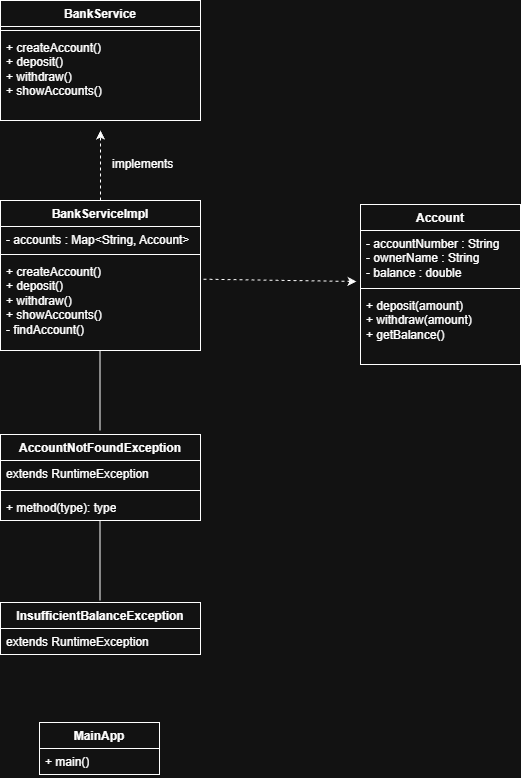

📘 Bank Management System (Java Console Application)

A Java console-based application demonstrating core Java and OOP principles, built as a portfolio project for Java Developer positions.


🎯 Project Purpose

This project was created to demonstrate:

Strong understanding of Java Core

Proper use of Object-Oriented Programming (OOP)

Clean code structure and best practices

Basic testing using JUnit

System design visualization using UML


🧩 Features

Create bank accounts

Deposit money

Withdraw money with balance validation

Display all accounts

Console-based interactive menu

Custom exception handling

Unit testing for core logic


🏗 Project Structure
```
src
 ├─ model
 │   └─ Account.java
 ├─ service
 │   ├─ BankService.java
 │   └─ BankServiceImpl.java
 ├─ exception
 │   ├─ AccountNotFoundException.java
 │   └─ InsufficientBalanceException.java
 ├─ util
 │   └─ Menu.java
 └─ main
     └─ MainApp.java

test
 ├─ AccountTest.java
 └─ BankServiceTest.java

docs
 └─ bank-system-uml.png
```

🧠 OOP Concepts Applied

Encapsulation
Private fields with public getters and controlled access

Inheritance
Custom exceptions extending RuntimeException

Polymorphism
BankService interface implemented by BankServiceImpl

Abstraction
Business logic separated via service layer


⚙️ Technologies Used

Java 25

IntelliJ IDEA

JUnit 5

Git & GitHub


🧪 Testing

Unit tests are implemented using JUnit 5 following the Arrange – Act – Assert pattern.

Tested Scenarios:

Successful deposit and withdrawal

Exception thrown when withdrawing more than balance

Service layer behavior


📐 UML Diagram



The system design is visualized using a UML Class Diagram:

📁 docs/BankSystem-UML.drawio.png


▶️ How to Run the Project

Clone the repository

Open the project in IntelliJ IDEA

Run MainApp.java

Follow the console menu instructions


🚀 Future Improvements

Add persistence using a database

Convert the project to Spring Boot REST API

Add logging

Improve input validation

Add more unit tests


👨‍💻 Author

Ali Al-Jalo
Java Developer (Backend)
